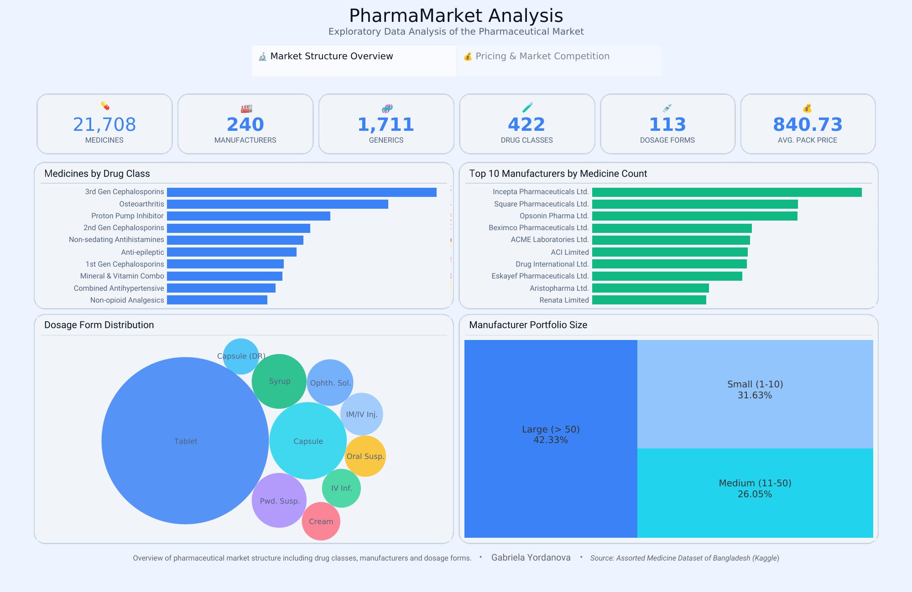
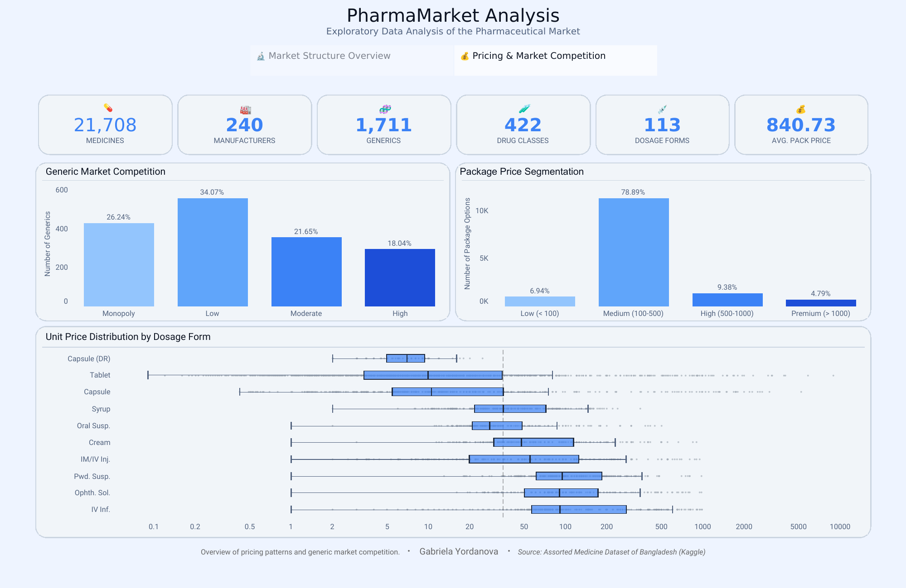

# PharmaMarket Visualization


## Overview

This project presents the final stage of the PharmaMarket Data Platform. It uses Tableau to visualise market structure, manufacturer portfolios, generic competition, dosage forms, package prices, and unit-price distributions for a pharmaceutical dataset from Bangladesh.

The packaged workbook includes an extract, so you can open and explore it without connecting to the local PostgreSQL database.

[View the interactive dashboard on Tableau Public](https://public.tableau.com/app/profile/gabriela.yordanova/viz/PharmaMarket_Visualization/PharmaMarketAnalysis)

## Dashboard Preview

### Market Structure Overview



### Pricing and Market Competition



## Dashboard Scope

The Tableau Story contains two dashboards and 13 worksheets.

### Market Structure Overview

| View | Purpose |
|---|---|
| KPI cards | Medicines, manufacturers, generics, drug classes, dosage forms, and average pack price |
| Medicines by Drug Class | Top 10 drug classes by distinct medicine count |
| Top 10 Manufacturers | Manufacturers with the largest medicine portfolios |
| Dosage Form Distribution | Relative medicine volume across the leading dosage forms |
| Manufacturer Portfolio Size | Manufacturers grouped into small, medium, and large portfolios |

### Pricing and Market Competition

| View | Purpose |
|---|---|
| Generic Market Competition | Generics grouped by the number of available brands |
| Package Price Segmentation | Package-size records grouped by pack price |
| Unit Price Distribution | Unit-price distributions for the leading dosage forms on a logarithmic scale |

The package-price chart counts package options, not unique medicines. One medicine can have more than one package-size record.

## Data Model

The workbook uses a relationship-based Tableau data source with `medicine` as its central table.

| Related table | Relationship |
|---|---|
| `generic` | `medicine.generic_id = generic.generic_id` |
| `drug_class` | `generic.drug_class_id = drug_class.drug_class_id` |
| `manufacturer` | `medicine.manufacturer_id = manufacturer.manufacturer_id` |
| `dosage_form` | `medicine.dosage_form_id = dosage_form.dosage_form_id` |
| `medicine_package_size` | `medicine.brand_id = medicine_package_size.brand_id` |
| `medicine_package_container` | `medicine.brand_id = medicine_package_container.brand_id` |

Tableau relationships preserve the separate table grains and avoid multiplying medicine, package-size, and container rows in a single physical join.

## Verified Metrics

| Metric | Value |
|---|---:|
| Medicines | 21,708 |
| Manufacturers | 240 |
| Generics | 1,711 |
| Drug classes | 422 |
| Dosage forms | 113 |
| Average pack price | 840.73 BDT |

The segmentation charts have narrower scopes than the headline KPIs:

- Generic competition covers 1,635 generics represented by at least one medicine.
- Manufacturer portfolio size covers 215 manufacturers represented by at least one medicine.
- Package price segmentation covers 14,349 package-size records.

## Findings

- Large portfolios with more than 50 medicines form the largest represented manufacturer segment at 42.33%.
- Small portfolios account for 31.63%, while medium portfolios account for 26.05%.
- Low competition is the largest generic segment at 34.07%.
- Monopoly generics account for 26.24% of represented generics.
- Medium-priced package options from 100 to 500 BDT account for 78.89% of package-size records.
- Premium package options above 1,000 BDT account for 4.79%.

These results describe the supplied snapshot. They do not represent the complete pharmaceutical market in Bangladesh.

## Calculated Fields

The workbook uses eight documented calculated fields:

- `Brands Per Generic`
- `Competition Level`
- `Competition %`
- `Medicines Per Manufacturer`
- `Portfolio Size`
- `Portfolio Size %`
- `Price Segment`
- `Price Segment %`

Their formulas and scopes are documented in [calculated_fields.md](calculated_fields.md).

## Repository Structure

```text
PharmaMarket_Visualization/
|-- docs/
|   |-- Pharma_ERD.png
|   |-- dashboard_overview.png
|   `-- dashboard_pricing.png
|-- tests/
|   `-- test_workbook_contract.py
|-- PharmaMarket_Visualization.twbx
|-- calculated_fields.md
|-- LICENSE.txt
`-- README.md
```

## Related Projects

1. [PharmaMarket_ETL](https://github.com/GabrielaY0rdanova/PharmaMarket_ETL) builds the SQL Server database.
2. [PharmaMarket_Cleaning](https://github.com/GabrielaY0rdanova/PharmaMarket_Cleaning) cleans and validates the relational tables.
3. [PharmaMarket_EDA](https://github.com/GabrielaY0rdanova/PharmaMarket_EDA) migrates the snapshot to PostgreSQL and performs SQL analysis.
4. PharmaMarket_Visualization presents the final Tableau Story.

## Data Source

The original data comes from the Kaggle dataset [Assorted Medicine Dataset of Bangladesh](https://www.kaggle.com/datasets/ahmedshahriarsakib/assorted-medicine-dataset-of-bangladesh).

## Technologies

- Tableau Public
- Tableau relationships, LOD expressions, and table calculations
- PostgreSQL 18

## License

This project uses the [MIT License](LICENSE.txt).
